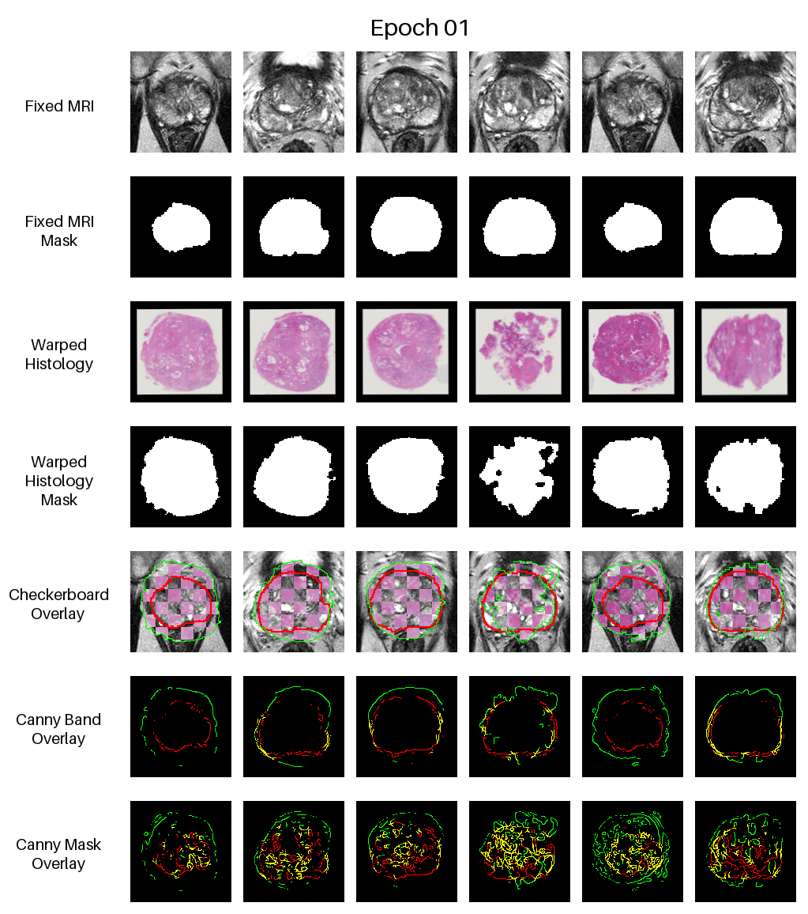

# Example Experiment

An experiment can be anything really. This one trains one model for 5+5 epochs with no data augmentation:



After setting up the appropriate environment, this experiment was launched with:

```zsh
python -m experiments.example.main
```